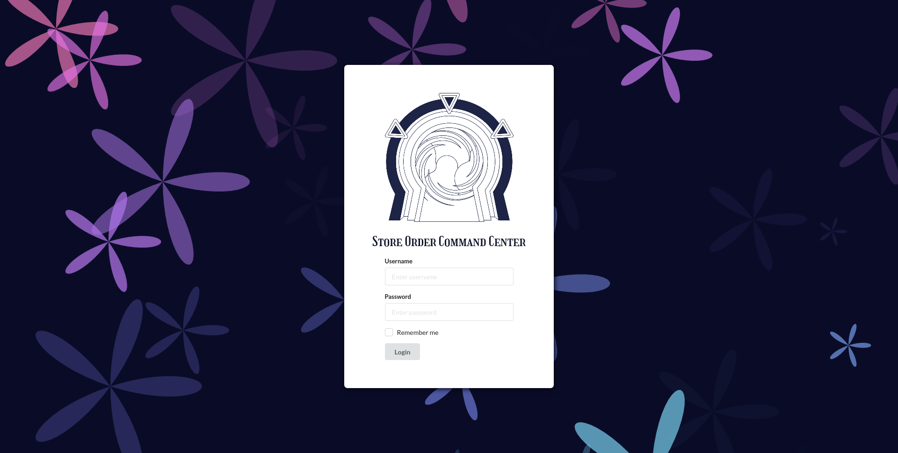
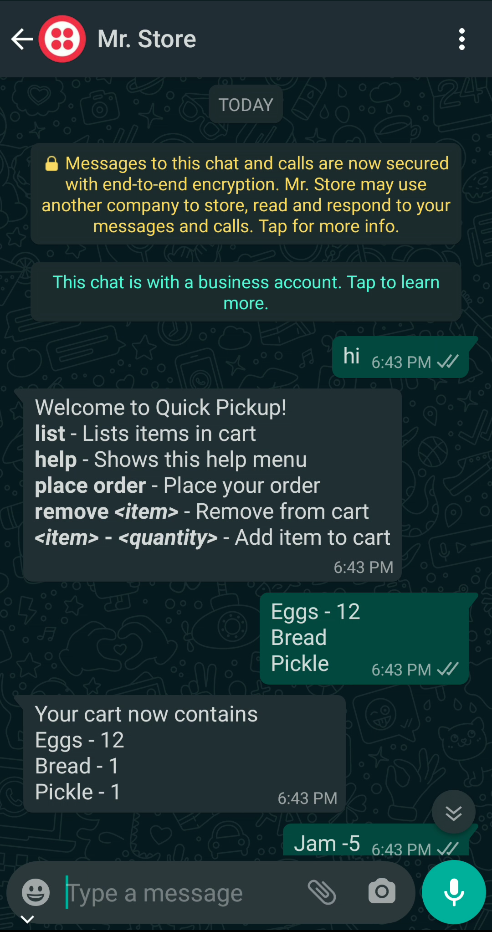
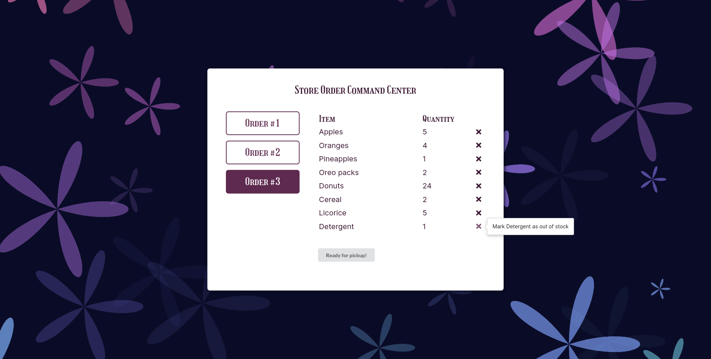

# Quick Pickup

Official hack for the Neighbourhood Hacks MLH Hackathon by Team Cheesy! 🧀

### Inspiration

Due to the Coronavirus pandemic, many states have been imposing lockdowns. Due to this, stores in the region are only allowed to stay open till 12 noon. This causes a lot of people crowding at the store, bringing down the effectiveness of the lockdown. Since stores are open for only half a day, they also bring a lot less revenue than usual.

### What it does

Quick Pickup is an platform that helps small businesses allow customers to order straight from the comfort of their homes. In short, there are two components to this project. Firstly, it comprises of a WhatsApp bot that customers can use to place orders. Secondly, there consists of a web portal with which the store can login and manage orders placed by the customers.

### Built by

- [Jason H.](https://github.com/Jason13201)
- [Joshua T.](https://github.com/radiantly)

Quite surprisingly, this project won the prize for the Best Domain Name 🎉
